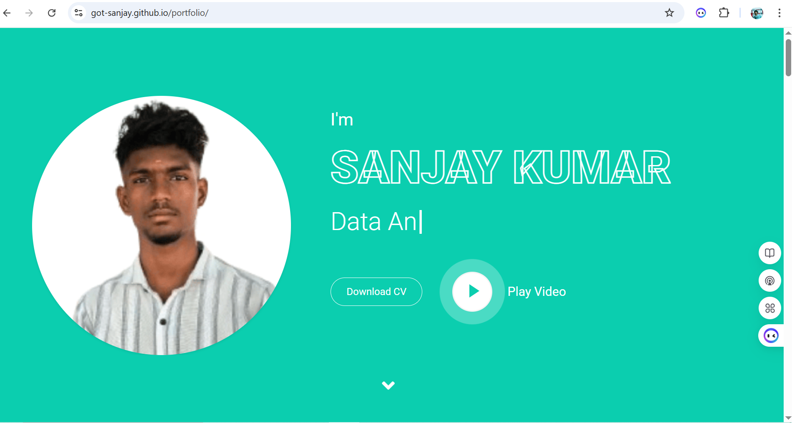
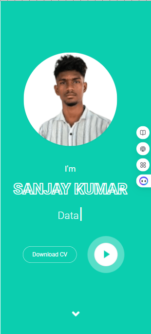

# 👨‍💻 Sanjay Kumar — Portfolio Website

Welcome to my personal portfolio repository. This site serves as a digital space to present my technical skills, professional journey, and freelance services in **data science**, **data analysis**, and **software development**.



---

## 📌 Overview

This portfolio highlights:

- 📊 **Data Analysis & Visualization**
- 🤖 **Machine Learning & AI Projects**
- 🛠️ **Freelance Work (Python, SQL, Power BI, Excel, Web Scraping)**
- 🧠 **Internship Experience & Academic Projects**
- 📨 **Direct Contact & Resume Download**

---

## 🌍 Live Preview

🖥️ **View Live:** [https://yourusername.github.io/portfolio](https://got-sanjay.github.io/portfolio)

---

## 🧰 Tech Stack

| Frontend  | UI/UX       | Tools       | Integration    |
|-----------|-------------|-------------|----------------|
| HTML5     | Bootstrap 4 | Git & GitHub| FormSubmit     |
| CSS3      | jQuery      | VS Code     | Font Awesome   |
| JavaScript| Owl Carousel| Lightbox    | Responsive Design |

---

## 🚀 Features

✅ Responsive design — mobile & desktop  
✅ Downloadable resume  
✅ Contact form with mail integration  
✅ Lightbox gallery for project visuals  
✅ Categorized project showcase (Python, BI, Excel, SQL)

---

## 📷 Portfolio Snapshots

<!-- ### 💻 Desktop View

 -->

### 📱 Mobile View



---

## 📁 How to Run Locally

```bash
git clone https://github.com/got-sanjay/portfolio.git
cd portfolio
open index.html
